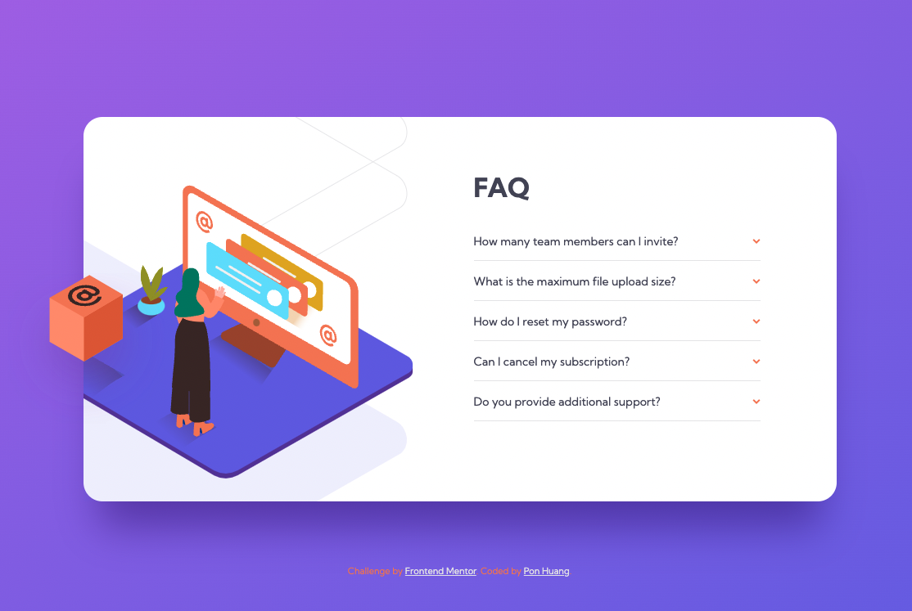
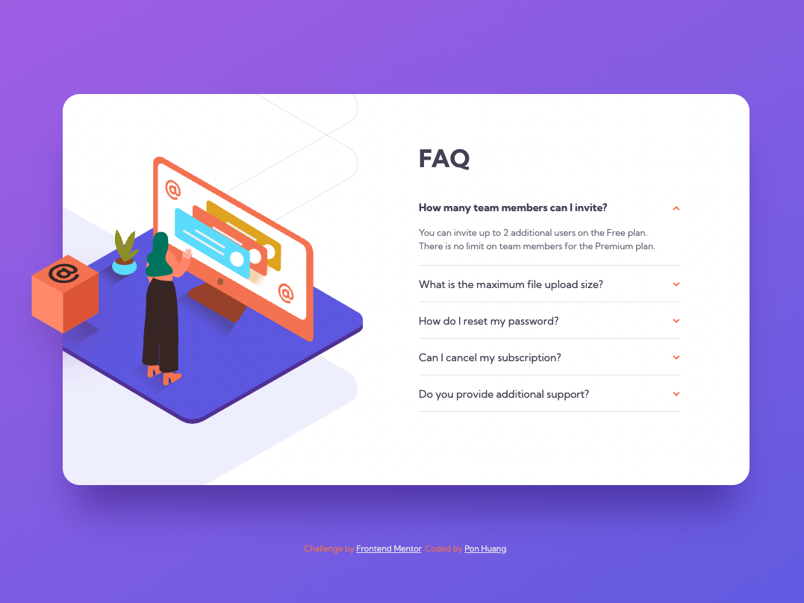
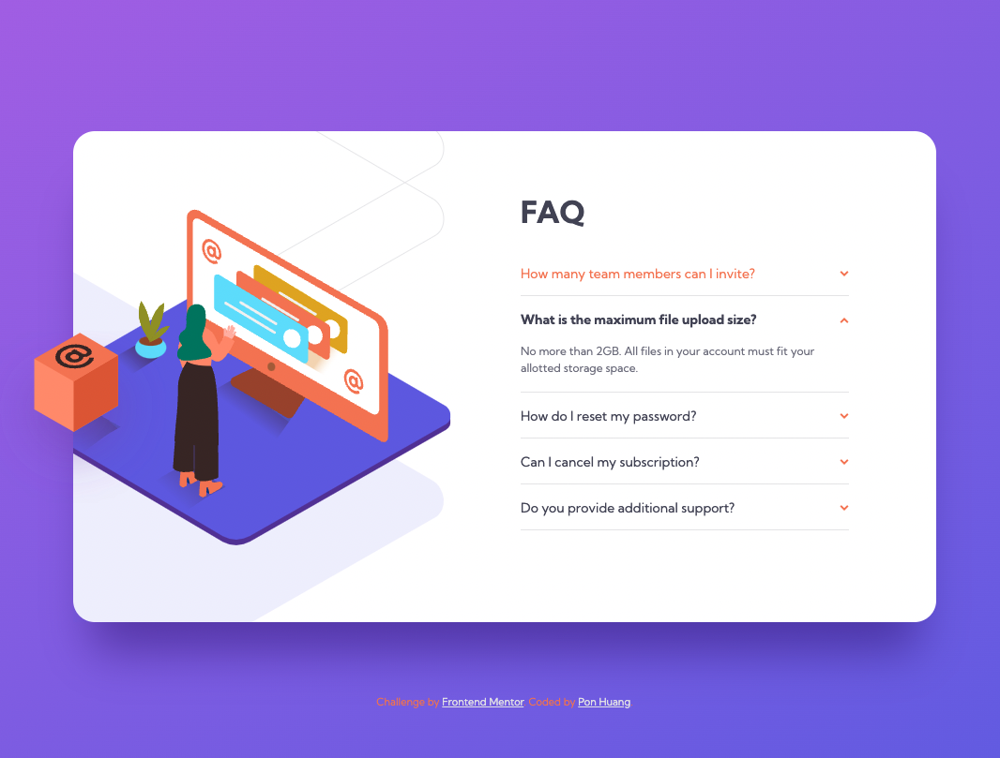
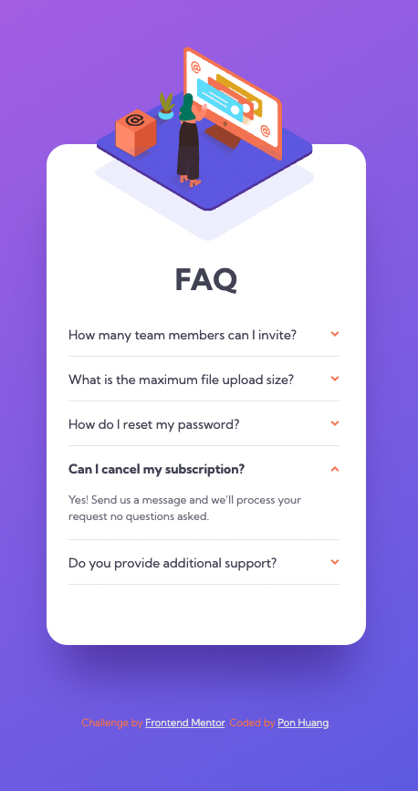

# Frontend Mentor - FAQ accordion card solution

This is a solution to the [FAQ accordion card challenge on Frontend Mentor](https://www.frontendmentor.io/challenges/faq-accordion-card-XlyjD0Oam). Frontend Mentor challenges help you improve your coding skills by building realistic projects.

## Table of contents

- [Overview](#overview)
  - [The challenge](#the-challenge)
  - [Screenshot](#screenshot)
  - [Links](#links)
- [My process](#my-process)
  - [Built with](#built-with)
  - [What I learned](#what-i-learned)
  - [Continued development](#continued-development)
  - [Useful resources](#useful-resources)
- [Author](#author)
- [Acknowledgments](#acknowledgments)

**Note: Delete this note and update the table of contents based on what sections you keep.**

## Overview

### The challenge

Users should be able to:

- View the optimal layout for the component depending on their device's screen size
- See hover states for all interactive elements on the page
- Hide/Show the answer to a question when the question is clicked

### Screenshot

Desktop


Active


Hover


Mobile


### Links

[Solution URL](https://github.com/ponhuang/faq-accordion-card)
[Live site URL](https://ponhuang.github.io/faq-accordion-card/)

## My process

### Built with

- Semantic HTML5 markup
- npm sass install
- SCSS custom properties
- Flexbox
- CSS Grid
- Desktop-first workflow
- JavaScript

### What I learned

How to build accordion component in HTML and CSS, learned it from Jonas Schmedtmann's HTML & CSS Course on Udemy.
If we use visibility then the border-bottom cannot display properly with spacing. In the case, better to use display: none / block.

```scss
.hidden {
  display: none;
}

.open .faq__question {
  font-weight: 700;

  &:hover,
  &:active {
    color: $color-dark-grayish-blue;
  }
}

.open .icon {
  transform: scaleY(-1);
}

.open .hidden {
  display: block;
}
```

### Continued development

Mobile media query issue.

- background size
- main-container size

### Useful resources

- [Add active class to current element](https://www.w3schools.com/howto/howto_js_active_element.asp) - This helped me to know to to add active class to current element from W3 SCHOOL

## Author

Pon Huang

- Instagram - [Pon Huang](https://www.instagram.com/ponhuang/)
- Art Blog - [une felt](https://une722.wordpress.com)

## Acknowledgments

097h
